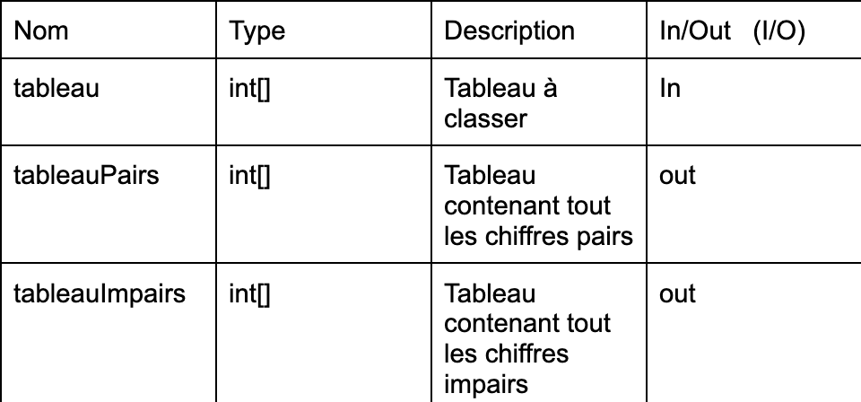
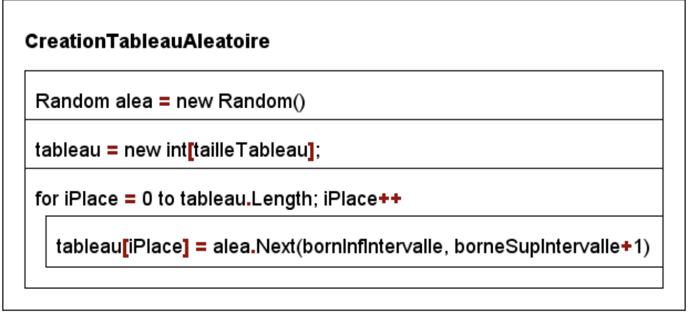

# Synthèse – Interrogation Tableaux (Analyse + C#)

## 1. Notions fondamentales sur les tableaux

### Déclaration d'un tableau

```csharp
int[] tableau;
````

### Création d'un tableau

```csharp
tableau = new int[taille];
```

Exemple :

```csharp
int[] tableau = new int[5];
```

Crée un tableau de 5 entiers.

---

## 2. Accéder aux éléments d’un tableau

On accède à une case avec son **indice**.

```csharp
tableau[i]
```

Exemple :

```csharp
Console.WriteLine(tableau[2]);
```

---

## 3. Taille d’un tableau

```csharp
tableau.Length
```

---

## 4. Parcourir un tableau

Structure classique :

```csharp
for (int i = 0; i < tableau.Length; i++)
{
    // action
}
```

À retenir :

| Élément              | Signification |
| -------------------- | ------------- |
| `i = 0`              | première case |
| `i < tableau.Length` | dernière case |
| `i++`                | case suivante |

---

# 5. Lire un entier (procédure LireEntier)

## But

Demander un nombre à l’utilisateur et vérifier qu’il est valide.

### Code

```csharp
static void LireEntier(string question, out int resultat)
{
    do
    {
        Console.WriteLine(question);
    }
    while (!int.TryParse(Console.ReadLine(), out resultat));
}
```

### À retenir

| Élément              | Signification           |
| -------------------- | ----------------------- |
| `Console.ReadLine()` | lire entrée utilisateur |
| `int.TryParse()`     | convertir en entier     |
| `!`                  | False                   |
| `out`                | renvoie une valeur      |

### Utilisation

```csharp
int nombre;
LireEntier("Entrez un nombre :", out nombre);
```

---

# 6. Concaténer un tableau (ConcateneTableau)

## But

Transformer un tableau en texte pour l'afficher.

### Code

```csharp
static void ConcatenerContenuTableau(int[] tableau, out string contenu)
{
    contenu = "";

    for (int i = 0; i < tableau.Length; i++)
    {
        contenu += tableau[i] + "; ";
    }
}
```

### Exemple résultat

```
4; 7; 2; 9;
```

---

# 7. Remplir un tableau

Exemple :

```csharp
for (int i = 0; i < tableau.Length; i++)
{
    LireEntier("Valeur : ", out tableau[i]);
}
```

---

## 8. Tester pair ou impair

#### Pair

```csharp
nombre % 2 == 0
```

#### Impair

```csharp
nombre % 2 != 0
```

---

## 9. Séparer pairs et impairs

Principe :

1. parcourir le tableau
2. tester pair ou impair
3. ranger dans un autre tableau

### Structure

```csharp
int iPair = 0;
int iImpair = 0;

for (int i = 0; i < tableau.Length; i++)
{
    if (tableau[i] % 2 == 0)
    {
        tableauPairs[iPair] = tableau[i];
        iPair++;
    }
    else
    {
        tableauImpairs[iImpair] = tableau[i];
        iImpair++;
    }
}
```

---

# 10. Générer des nombres aléatoires

### Création

```csharp
Random alea = new Random();
```

### Génération

```csharp
alea.Next(min, max)
```

⚠️ Important :

```
max n'est pas inclus
```

Donc :

```csharp
alea.Next(min, max + 1)
```

---

# 11. Création d’un tableau aléatoire

```csharp
static void CreationTableauAleatoire(int tailleTableau, int borneInf, int borneSup, out int[] tableau)
{
    Random alea = new Random();
    tableau = new int[tailleTableau];

    for (int iPlace = 0; iPlace < tableau.Length; iPlace++)
    {
        tableau[iPlace] = alea.Next(borneInf, borneSup + 1);
    }
}
```

---

# 12. Conditions importantes

### Taille tableau valide

```
taille > 0
```

### Bornes valides

```
borneSup >= borneInf
```

---

# 13. Structure typique d’un programme

```
Lire les données
↓
Vérifier les conditions
↓
Créer ou remplir le tableau
↓
Traiter les données
↓
Afficher le résultat
```

---

# 14. Image exemples des analyses

### Analyse docs 


### GNS


---

# 15. Erreurs classiques (très fréquentes à l’interro)

### Mauvaise condition de boucle

❌

```
i <= tableau.Length
```

✔

```
i < tableau.Length
```

---

### Mauvais accès au tableau

❌

```
tableau[i+1]
```

✔

```
tableau[i]
```

---


# 16. Les 10 choses essentielles à retenir

1. `int[] tableau`
2. `new int[taille]`
3. `tableau.Length`
4. `for (int i = 0; i < tableau.Length; i++)`
5. `tableau[i]`
6. `nombre % 2 == 0`
7. `out`
8. `int.TryParse`
9. `Random alea = new Random()`
10. `alea.Next(min, max + 1)`

---

